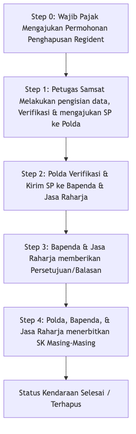

# Sistem Informasi Penghapusan Registrasi & Identifikasi Kendaraan Bermotor (Hapus Regident)

Selamat datang di dokumentasi resmi **Sistem Informasi Penghapusan Registrasi dan Identifikasi Kendaraan Bermotor (Hapus Regident)** Direktorat Lalu Lintas (Ditlantas) Provinsi Jawa Tengah.

Aplikasi ini merupakan platform digital terintegrasi yang dirancang untuk memfasilitasi, melacak, dan mengotomatisasi proses bisnis penghapusan data kendaraan bermotor di Jawa Tengah secara cepat, transparan, dan akuntabel.

---

## Tujuan Utama Aplikasi

*   **Digitalisasi Birokrasi**: Mengubah proses manual pengajuan penghapusan kendaraan bermotor menjadi alur kerja digital yang terpantau secara real-time.
*   **Kolaborasi Antar-Instansi**: Menghubungkan Samsat (Verifikator Cabang), Kepolisian Daerah/Polda (Regident Polantas), Bapenda (Fiskal Daerah), dan Jasa Raharja (SWDKLLJ) dalam satu ekosistem.
*   **Keamanan & Akuntabilitas**: Implementasi Role-Based Access Control (RBAC) ketat dan pelacakan audit melalui log aktivitas yang komprehensif.

---

## Alur Kerja (Workflow) Utama

Proses pengajuan penghapusan kendaraan dibagi menjadi beberapa tahapan dari pengisian draf hingga penerbitan Surat Keputusan (SK) akhir:

---

## Peta Dokumentasi

Gunakan navigasi di atas atau tautan di bawah ini untuk menjelajahi dokumentasi:

*   **[Arsitektur & Teknologi](arsitektur.md)**: Detail stack teknologi, struktur database, dan arsitektur integrasi sistem.
*   **[Panduan Instalasi](instalasi.md)**: Panduan langkah demi langkah untuk melakukan deploy aplikasi di lingkungan pengembangan (local development).
*   **[Hak Akses (RBAC)](rbac.md)**: Matriks peran pengguna (Wajib Pajak, Samsat, Polda, Bapenda, Jasa Raharja, Superadmin) dan izinnya.
*   **Panduan Penggunaan**:
    *   **[Panduan Wajib Pajak](manual/wajib_pajak.md)**: Langkah-langkah bagi warga/dealer untuk mendaftarkan kendaraan.
    *   **[Panduan Petugas](manual/petugas.md)**: Alur kerja dan petunjuk teknis bagi verifikator instansi.
*   **[Troubleshooting](troubleshooting.md)**: Solusi atas masalah umum dan riwayat perbaikan sistem.
