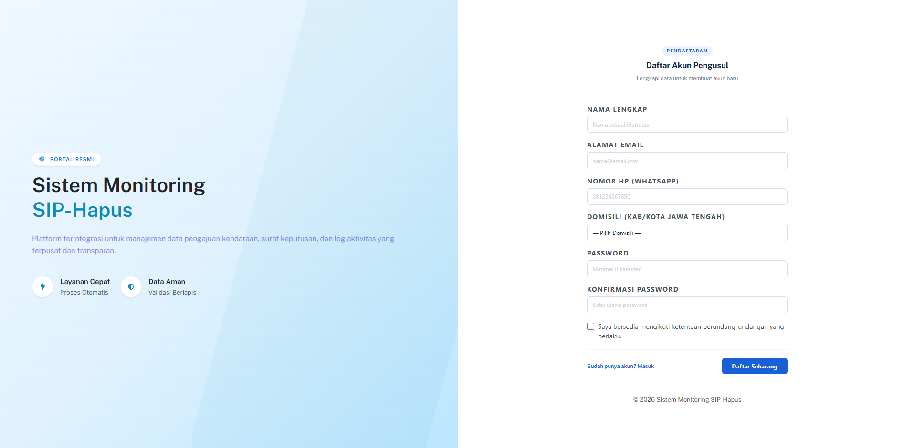
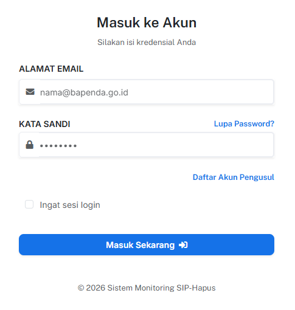
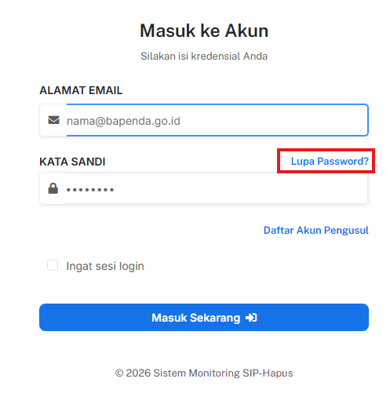
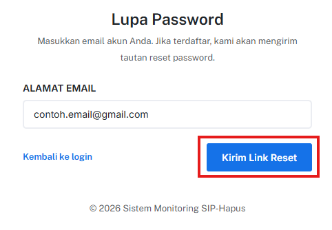
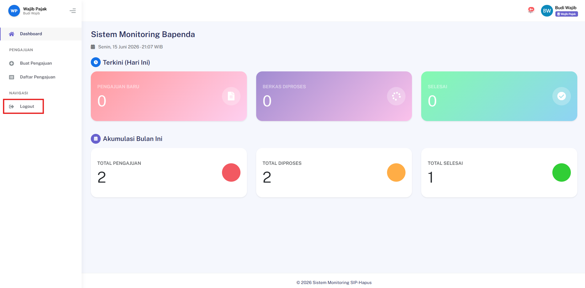

## Registrasi Akun Wajib Pajak Baru

### Deskripsi
Fitur ini memungkinkan pengguna baru untuk membuat akun sebagai Wajib Pajak pada sistem.

### Prasyarat
- Belum memiliki akun terdaftar
- Memiliki data diri yang valid (Nama, Email, NIK)

### Langkah-Langkah

**Langkah 1 — Akses Halaman Registrasi**

Buka browser dan navigasi ke halaman:
```
/register
```



**Langkah 2 — Isi Formulir Registrasi**

Lengkapi seluruh kolom yang tersedia dengan data yang valid:

| Kolom | Keterangan |
|---|---|
| **Nama** | Nama lengkap sesuai identitas |
| **Email** | Alamat email aktif yang dapat diakses |
| **NIK** | Nomor Induk Kependudukan (16 digit) |
| **Password** | Kata sandi minimal 8 karakter |
| **Konfirmasi Password** | Ulangi kata sandi yang sama |

> ⚠️ **Pastikan** NIK yang dimasukkan sesuai dengan KTP dan email yang digunakan adalah email aktif, karena akan digunakan untuk verifikasi akun.

**Langkah 3 — Kirim Formulir**

Klik tombol **Register** untuk menyelesaikan proses pendaftaran.

### Hasil yang Diharapkan
- Akun berhasil dibuat dan sistem menampilkan pesan konfirmasi.
- Pengguna diarahkan ke halaman login atau dashboard.

---
## Login Pengguna (Semua Role)

### Deskripsi
Fitur ini memungkinkan pengguna yang sudah terdaftar untuk masuk ke dalam sistem sesuai role masing-masing.

### Prasyarat
- Akun sudah terdaftar dan terverifikasi

### Langkah-Langkah

**Langkah 1 — Akses Halaman Login**

Buka browser dan navigasi ke halaman:
```
/login
```



**Langkah 2 — Masukkan Kredensial**

Isi kolom berikut dengan data yang valid:

| Kolom | Keterangan |
|---|---|
| **Email** | Email yang digunakan saat registrasi |
| **Password** | Kata sandi akun |

**Langkah 3 — Masuk ke Sistem**

Klik tombol **Masuk Sekarang** untuk mengakses sistem.

### Hasil yang Diharapkan
- Pengguna berhasil masuk dan diarahkan ke dashboard sesuai role (Wajib Pajak, Admin, dll).

---
## Lupa Password & Reset Password

### Deskripsi
Fitur ini memungkinkan pengguna yang lupa kata sandi untuk mengatur ulang password melalui email terdaftar.

### Prasyarat
- Akun dengan email valid sudah terdaftar di sistem

### Langkah-Langkah

**Langkah 1 — Akses Fitur Lupa Password**

Di halaman `/login`, klik tautan **Forgot your password?**



**Langkah 2 — Kirim Tautan Reset**

Masukkan alamat email yang terdaftar, lalu klik tombol **Email Password Reset Link**.



> 📧 Sistem akan mengirimkan email berisi tautan reset password ke alamat yang dimasukkan.

**Langkah 3 — Buka Tautan Reset**

Buka email masuk, lalu klik tautan reset password yang diterima.

> ⚠️ Tautan reset biasanya memiliki batas waktu. Segera gunakan sebelum kedaluwarsa.

**Langkah 4 — Atur Password Baru**

Isi kolom berikut, lalu klik tombol **Reset Password**:

| Kolom | Keterangan |
|---|---|
| **Password Baru** | Kata sandi baru yang diinginkan |
| **Konfirmasi Password** | Ulangi kata sandi baru |

### Hasil yang Diharapkan
- Password berhasil diperbarui dan pengguna dapat login menggunakan password baru.

---
## Logout Pengguna

### Deskripsi
Fitur ini memungkinkan pengguna untuk keluar dari sesi aktif secara aman.

### Prasyarat
- Pengguna sedang dalam kondisi login aktif

### Langkah-Langkah

**Langkah 1 — Logout dari Sistem**

Klik tombol atau menu **Logout** yang tersedia di halaman (biasanya di pojok kanan atas atau menu navigasi).



### Hasil yang Diharapkan
- Sesi pengguna berakhir dan sistem mengarahkan kembali ke halaman `/login`.

> 💡 Selalu lakukan logout setelah selesai menggunakan sistem, terutama pada perangkat yang digunakan bersama.
