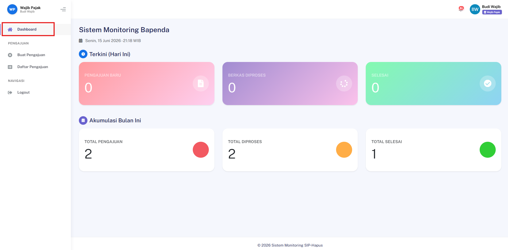

## Menampilkan Statistik Monitoring

### Deskripsi
Halaman dashboard menampilkan ringkasan statistik dan monitoring aktivitas sistem secara keseluruhan.

### Prasyarat
- Pengguna sudah login

### Langkah-Langkah

**Langkah 1 — Login ke Aplikasi**

Pastikan pengguna sudah berhasil login ke sistem.

**Langkah 2 — Buka Halaman Dashboard**

Navigasi ke halaman:
```
/dashboard
```



### Hasil yang Diharapkan
- Halaman menampilkan statistik dan data monitoring sesuai role pengguna yang sedang aktif.
