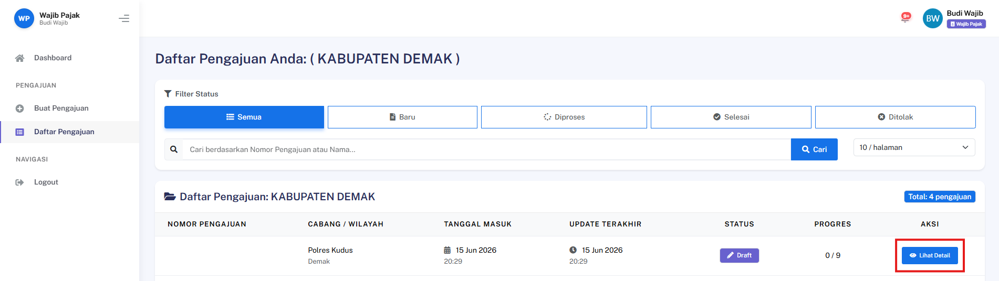
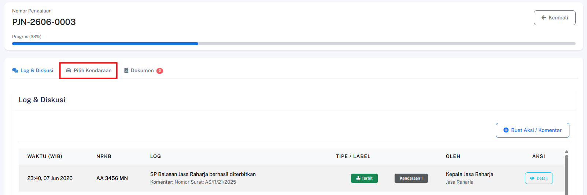
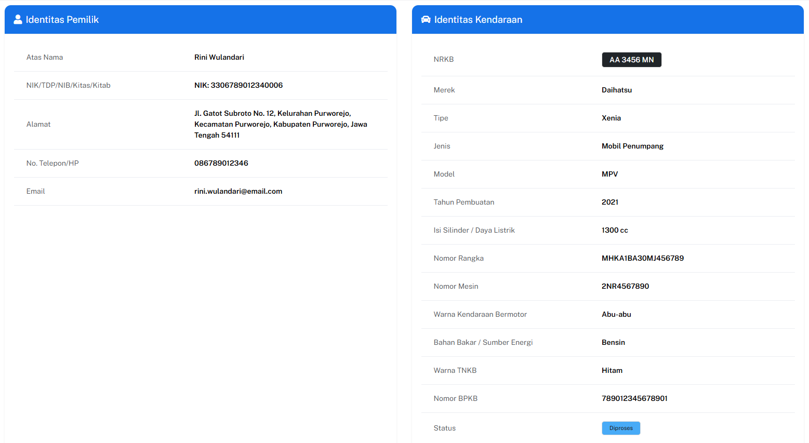

## Lihat Detail Kendaraan (Read-Only)

### Deskripsi
Fitur ini memungkinkan pengguna untuk melihat informasi lengkap suatu kendaraan tanpa dapat mengubahnya.

### Prasyarat
- Login sebagai WP pemilik atau Admin

### Langkah-Langkah

**Langkah 1 — Buka Detail Pengajuan**

Akses halaman detail pengajuan yang memuat kendaraan yang ingin dilihat.

**Langkah 2 — Klik Nama/NRKB Kendaraan**

Klik **Pilih Kendaraan** dan pilih NRKB kendaraan untuk membuka halaman detail kendaraan.

### Hasil yang Diharapkan
- Halaman menampilkan seluruh informasi kendaraan dalam mode baca saja (read-only).

