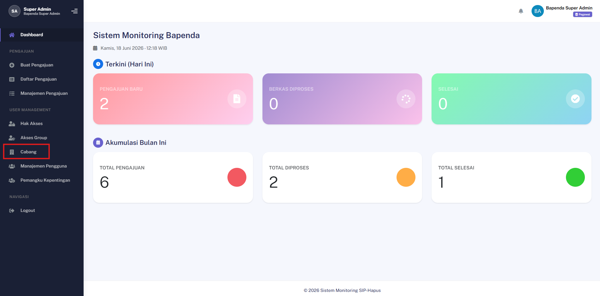
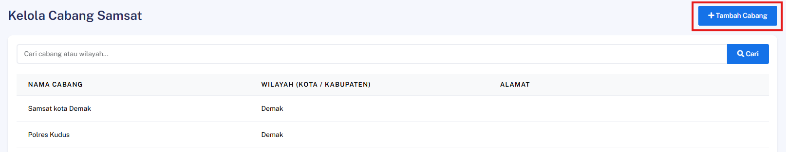
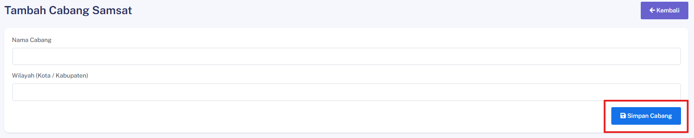

## Tambah Cabang Baru

### Deskripsi
Fitur ini memungkinkan Admin untuk menambahkan kantor cabang atau Samsat baru ke dalam sistem melalui menu Manajemen Cabang.

### Prasyarat
- Login sebagai Admin

### Langkah-Langkah

**Langkah 1 — Buka Menu Cabang/Samsat**

Akses menu utama dan pilih menu Cabang/Samsat.

**Langkah 2 — Klik Tambah Cabang**

Klik tombol **Tambah Cabang** untuk membuka formulir input.

**Langkah 3 — Isi Nama dan Wilayah**

Masukkan informasi Nama Cabang dan Wilayah pada kolom yang tersedia.

**Langkah 4 — Klik Simpan**

Klik tombol **Simpan** untuk merekam data ke dalam sistem.

### Hasil yang Diharapkan
- Cabang baru berhasil dibuat dan muncul di daftar.
