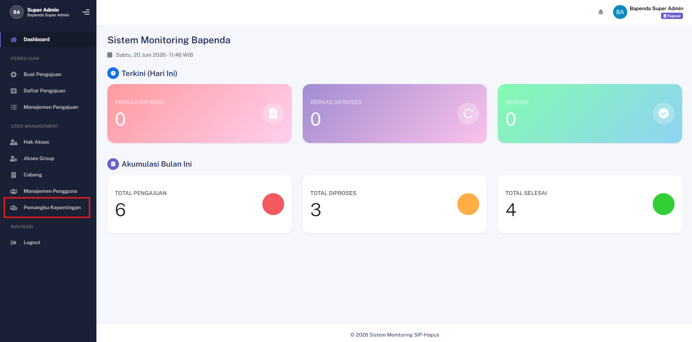
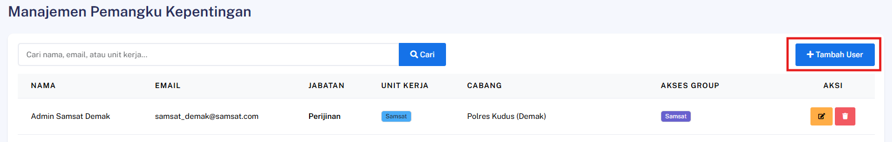
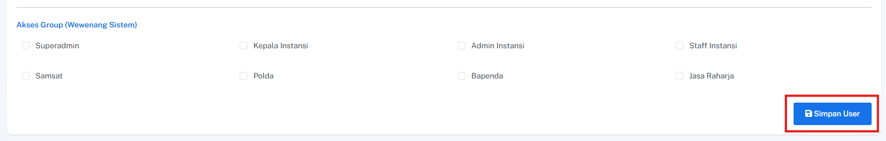
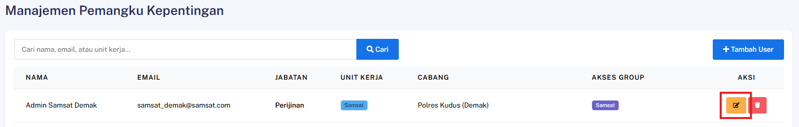
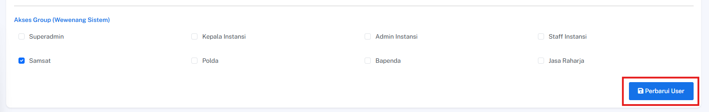
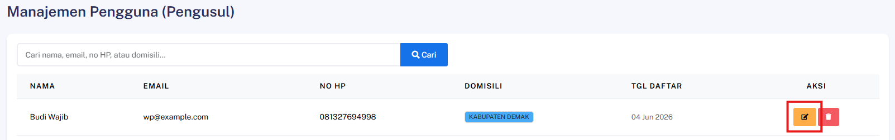
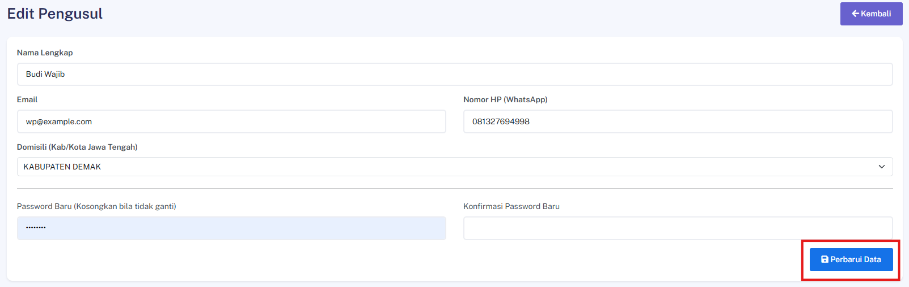
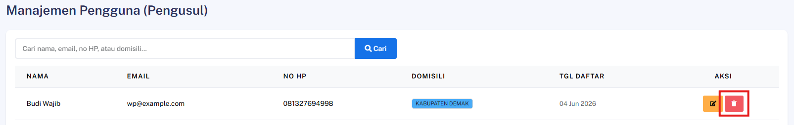

## Tambah Akun Stakeholder Baru

### Deskripsi
Fitur ini memungkinkan Admin untuk membuat akun pengguna baru bagi pihak *stakeholder* ke dalam sistem dengan hak akses yang disesuaikan berdasarkan peran (*role*) masing-masing.

### Prasyarat
- Pengguna telah login ke dalam sistem sebagai **Admin**
- Memiliki hak akses khusus untuk manajemen pengguna

### Langkah-Langkah

**Langkah 1 — Akses Menu Manajemen Pengguna**

Buka menu navigasi utama, lalu masuk ke menu **Pemangku Kepentingan**.

**Langkah 2 — Inisiasi Tambah Pengguna**

Cari dan klik tombol **Tambah User** untuk membuka formulir input data.

**Langkah 3 — Isi Formulir Data Pengguna**

Lengkapi data identitas dan pengaturan hak akses pada kolom yang tersedia:

| Kolom | Keterangan |
|---|---|
| **Nama Lengkap** | Masukkan nama lengkap instansi atau nama perwakilan |
| **Email** | Alamat email aktif untuk keperluan log masuk dan notifikasi |
| **Password** | Password yang akan digunakan user tersebut untuk login |
| **Jabatan** | Jabatan user baru saat ini |
| **Unit Kerja** | Pilih peran khusus (contoh: Polda, Bapenda, Jasa Raharja) |
| **Cabang Samsat** | Pilih wilayah cabang samsat yang terkait |

**Langkah 4 — Simpan Data Pengguna**

Klik tombol **Simpan User** untuk mendaftarkan akun baru ke dalam sistem.

### Hasil yang Diharapkan
- Akun *stakeholder* baru berhasil dibuat oleh sistem.
- Data identitas dan relasi instansi berhasil tersimpan secara aman di dalam basis data.
- Akun yang baru dibuat otomatis memiliki konfigurasi hak akses yang sesuai dengan *role* yang dipilih.

---
## Edit Akun Stakeholder

### Deskripsi
Fitur ini memungkinkan Admin untuk memperbarui informasi data diri, peran (*role*), atau wilayah kerja (*cabang*) pada akun *stakeholder* yang sudah terdaftar di dalam sistem.

### Prasyarat
- Pengguna telah login ke dalam sistem sebagai **Admin**
- Akun *stakeholder* yang akan diubah sudah terdaftar dan tersedia pada sistem

### Langkah-Langkah

**Langkah 1 — Akses Daftar Stakeholder**

Buka menu navigasi utama, masuk ke menu **Pemangku Kepentingan** untuk menampilkan seluruh daftar akun yang ada.

**Langkah 2 — Pilih Akun Target**

Cari akun *stakeholder* yang ingin diubah, lalu klik tombol **Edit** pada baris data akun tersebut.

**Langkah 3 — Ubah Informasi Data Pengguna**

Perbarui informasi data pada kolom formulir yang ingin diganti:

| Kolom | Keterangan |
|---|---|
| **Nama Lengkap** | Masukkan nama lengkap instansi atau nama perwakilan |
| **Email** | Alamat email aktif untuk keperluan log masuk dan notifikasi |
| **Password** | Password yang akan digunakan user tersebut untuk login |
| **Jabatan** | Jabatan user baru saat ini |
| **Unit Kerja** | Pilih peran khusus (contoh: Polda, Bapenda, Jasa Raharja) |
| **Cabang Samsat** | Pilih wilayah cabang samsat yang terkait |

**Langkah 4 — Terapkan Pembaruan Data**

Klik tombol **Perbarui User** untuk menyimpan perubahan data ke dalam sistem.

### Hasil yang Diharapkan
- Data akun *stakeholder* terkait berhasil diperbarui oleh sistem dengan informasi terbaru.
- Perubahan data langsung diimplementasikan pada hak akses dan profil akun yang bersangkutan.

---
## Edit Akun Wajib Pajak oleh Admin

### Deskripsi
Fitur ini memungkinkan Admin untuk memperbarui informasi profil pada akun Wajib Pajak (WP) yang sudah terdaftar di dalam sistem.

### Prasyarat
- Pengguna telah login ke dalam sistem sebagai **Admin**
- Akun Wajib Pajak (WP) yang akan diubah sudah terdaftar dan tersedia pada sistem

### Langkah-Langkah

**Langkah 1 — Akses Daftar Wajib Pajak**

Buka menu navigasi utama, lalu masuk ke menu **Manajemen Pengguna** untuk menampilkan daftar seluruh akun WP.

**Langkah 2 — Pilih Wajib Pajak Target**

Cari akun Wajib Pajak yang ingin diubah, lalu klik tombol **Edit** pada baris data akun tersebut.

**Langkah 3 — Ubah Informasi Profil**

Perbarui informasi data profil Wajib Pajak pada kolom formulir yang tersedia sesuai dengan kebutuhan perubahan.

**Langkah 4 — Terapkan Pembaruan Data**

Klik tombol **Perbarui Data** untuk menyimpan perubahan data ke dalam sistem.

### Hasil yang Diharapkan
- Data akun Wajib Pajak terkait berhasil diperbarui oleh sistem dengan informasi profil terbaru.
- Seluruh perubahan data berhasil tersimpan dengan aman di dalam basis data.

---
## Hapus Akun Pengguna

### Deskripsi
Fitur ini memungkinkan Admin untuk menghapus akun pengguna (baik Wajib Pajak maupun *Stakeholder*) secara permanen dari sistem untuk mencabut hak akses mereka secara total.

### Prasyarat
- Pengguna telah login ke dalam sistem sebagai **Admin**
- Akun pengguna yang akan dihapus sudah terdaftar dan tersedia pada sistem

### Langkah-Langkah

**Langkah 1 — Akses Daftar Pengguna**

Buka menu navigasi utama, lalu pilih **Manajemen Pengguna** untuk mengakses menu Wajib Pajak dan pilih **Pemangku Kepentingan** untuk mengakses menu *Stakeholder*.

**Langkah 2 — Inisiasi Penghapusan Akun**

Cari akun pengguna yang dituju dari daftar, lalu klik tombol **Hapus** pada baris data akun tersebut.

**Langkah 3 — Konfirmasi Tindakan**

Sistem akan menampilkan jendela peringatan. Periksa kembali nama akun, lalu klik tombol **Konfirmasi** untuk menyetujui proses penghapusan.

> ⚠️ **Peringatan Kritis:** Tindakan ini bersifat permanen. Akun yang telah dihapus tidak dapat dipulihkan kembali dan semua sesi aktif pengguna tersebut akan langsung dihentikan oleh sistem.

### Hasil yang Diharapkan
- Akun pengguna terkait berhasil dihapus secara permanen dari basis data (*database*).
- Pengguna yang telah dihapus otomatis kehilangan hak akses dan tidak dapat melakukan proses *login* kembali ke dalam sistem.
