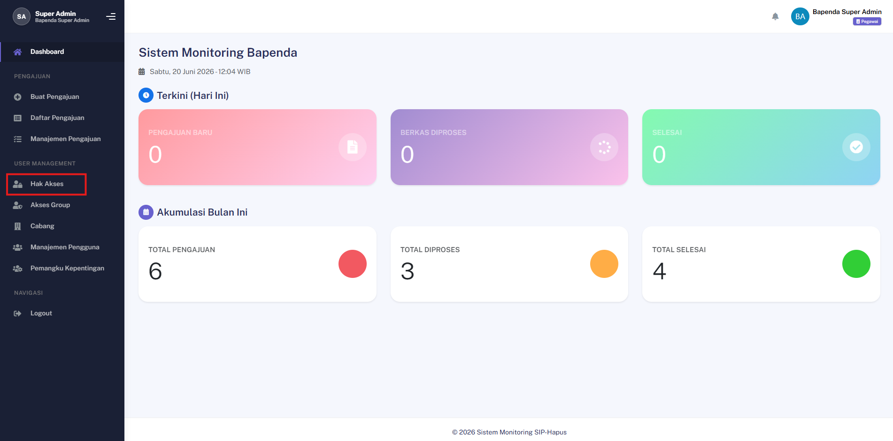
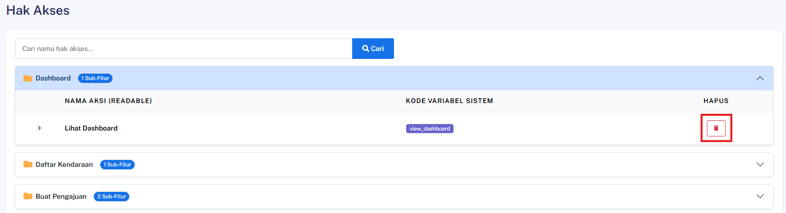

## Hapus Permission

### Deskripsi
Fitur ini memungkinkan Admin untuk menghapus suatu entitas hak akses (*permission*) secara permanen dari sistem agar tidak dapat digunakan lagi dalam konfigurasi peran (*role*).

### Prasyarat
- Pengguna telah login ke dalam sistem sebagai **Admin**
- Entitas hak akses (*permission*) yang akan dihapus sudah terdaftar dan tersedia pada sistem

### Langkah-Langkah

**Langkah 1 — Akses Daftar Permission**

Buka menu navigasi utama, lalu pilih menu **Hak Akses** untuk menampilkan tabel daftar seluruh hak akses yang ada.

**Langkah 2 — Inisiasi Penghapusan Hak Akses**

Cari *permission* target yang ingin dihapus dari daftar dan klik ikon dropdown, lalu klik tombol **Hapus** pada baris data tersebut.

**Langkah 3 — Konfirmasi Tindakan**

Sistem akan menampilkan jendela peringatan konfirmasi. Periksa kembali nama kunci *permission* tersebut, lalu klik tombol **Konfirmasi** untuk menyetujui proses penghapusan.

> ⚠️ **Peringatan Kritis:** Tindakan ini bersifat permanen. Menghapus *permission* yang sedang digunakan oleh suatu *role* dapat mencabut hak akses tersebut dari pengguna terkait secara otomatis.

### Hasil yang Diharapkan
- Entitas hak akses (*permission*) target berhasil dihapus secara permanen dari basis data (*database*).
- *Permission* tersebut tidak lagi muncul dalam daftar pilihan konfigurasi peran sistem.
