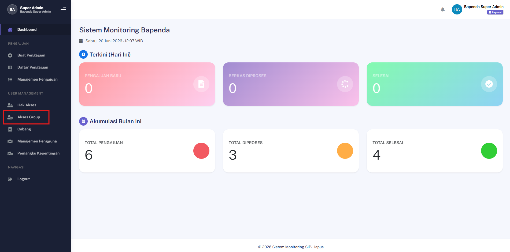
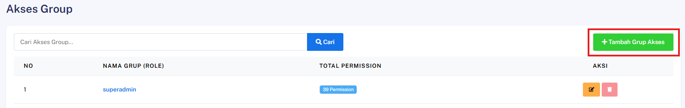
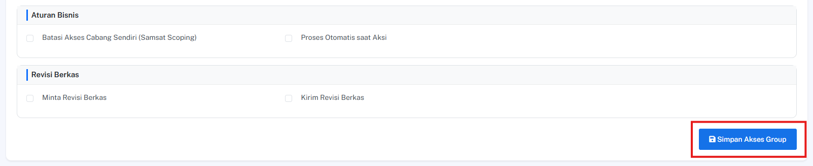
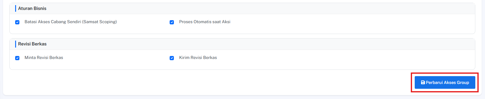
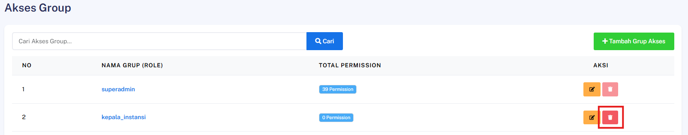

## Tambah Role Baru

### Deskripsi
Fitur ini memungkinkan Admin untuk membuat peran (*role*) baru di dalam sistem dan menentukan kombinasi hak akses (*permissions*) khusus yang melekat pada peran tersebut.

### Prasyarat
- Pengguna telah login ke dalam sistem sebagai **Admin**
- Memiliki hak akses khusus untuk manajemen peran dan otorisasi

### Langkah-Langkah

**Langkah 1 — Akses Menu Group Akses**

Buka menu navigasi utama aplikasi, lalu cari dan pilih menu **Akses Group**.

**Langkah 2 — Inisiasi Tambah Role**

Cari dan klik tombol **Tambah Role Baru** untuk membuka halaman pembuatan konfigurasi peran baru.

**Langkah 3 — Atur Nama dan Hak Akses**

Lengkapi informasi data peran serta tentukan batasan sistem pada formulir yang tersedia:

| Kolom / Komponen | Keterangan |
|---|---|
| **Nama Grup Akses** | Masukkan nama identitas peran baru (contoh: Verifikator Lapangan) |
| **Permissions Checkbox** | Centang daftar hak akses spesifik yang ingin diberikan pada role ini |

**Langkah 4 — Simpan Konfigurasi Peran**

Klik tombol **Simpan Akses Group** untuk mendaftarkan struktur peran baru tersebut ke dalam sistem.

### Hasil yang Diharapkan
- *Role* baru berhasil dibuat dan terdaftar ke dalam sistem.
- Kombinasi hak akses (*permissions*) yang dicentang berhasil terikat secara akurat pada peran baru tersebut.

---
## Edit Role & Ubah Permissions

### Deskripsi
Fitur ini memungkinkan Admin untuk memperbarui nama peran (*role*) serta mengubah susunan hak akses (*permissions*) yang melekat pada peran tersebut di dalam sistem.

### Prasyarat
- Pengguna telah login ke dalam sistem sebagai **Admin**
- Peran (*role*) yang akan diubah sudah terdaftar dan tersedia pada sistem

### Langkah-Langkah

**Langkah 1 — Akses Daftar Role**

Buka menu navigasi utama, lalu pilih menu **Akses Group** untuk menampilkan daftar seluruh peran yang tersedia.

**Langkah 2 — Pilih Role Target**

Cari peran yang ingin diubah dari daftar, lalu klik tombol **Edit** pada baris data peran tersebut.

**Langkah 3 — Sesuaikan Informasi dan Hak Akses**

Perbarui informasi data peran serta ubah batasan sistem pada komponen formulir yang tersedia:

| Kolom / Komponen | Keterangan |
|---|---|
| **Nama Grup Akses** | Ubah nama identitas peran jika diperlukan |
| **Permissions Checkbox** | Berikan tanda centang untuk menambah hak akses, atau hapus centang untuk mencabut hak akses |

**Langkah 4 — Terapkan Pembaruan Peran**

Klik tombol **Perbarui Akses Group** untuk menyimpan perubahan konfigurasi ke dalam sistem.

---
## Hapus Role

### Deskripsi
Fitur ini memungkinkan Admin untuk menghapus suatu peran (*role*) tertentu secara permanen dari sistem, dengan catatan peran tersebut bukan merupakan peran utama sistem (*superadmin*).

### Prasyarat
- Pengguna telah login ke dalam sistem sebagai **Admin**
- Peran (*role*) yang akan dihapus sudah terdaftar dan bukan merupakan peran **'superadmin'**

### Langkah-Langkah

**Langkah 1 — Akses Daftar Role**

Buka menu navigasi utama, lalu pilih menu **Akses Group** untuk menampilkan daftar seluruh peran yang tersedia pada sistem.

**Langkah 2 — Inisiasi Penghapusan Role**

Cari peran target yang ingin dihapus dari daftar, lalu klik tombol **Hapus** pada baris data peran tersebut.

**Langkah 3 — Konfirmasi Tindakan**

Sistem akan menampilkan jendela peringatan konfirmasi. Periksa kembali nama peran tersebut, lalu klik tombol **Konfirmasi** untuk menyetujui proses penghapusan.

> ⚠️ **Peringatan Kritis:** Penghapusan ini bersifat permanen. Pastikan tidak ada pengguna aktif yang masih bergantung pada peran ini sebelum melakukan konfirmasi penghapusan.

### Hasil yang Diharapkan
- Peran (*role*) target berhasil dihapus secara permanen dari basis data (*database*).
- Peran tersebut tidak lagi muncul dalam daftar pilihan peran sistem.
