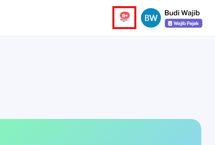
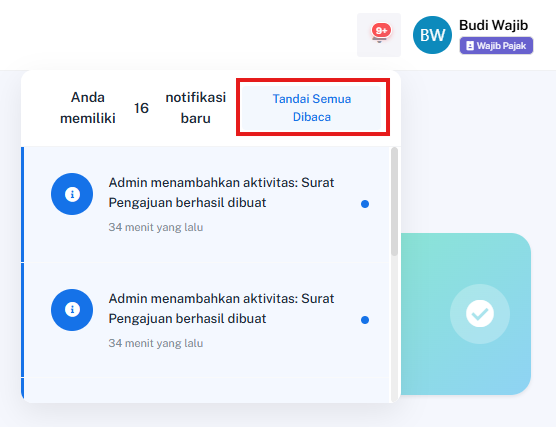
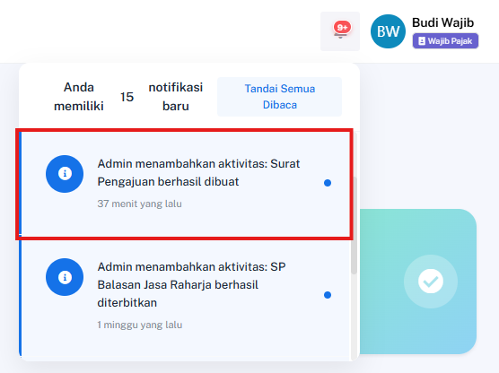

## Tandai Semua Notifikasi sebagai Dibaca

### Deskripsi
Fitur ini memungkinkan pengguna untuk mengubah status seluruh notifikasi yang belum dibaca menjadi sudah dibaca sekaligus melalui menu header.

### Prasyarat
- Pengguna sudah login ke dalam sistem
- Pengguna memiliki notifikasi dengan status belum dibaca

### Langkah-Langkah

**Langkah 1 — Klik Ikon Lonceng Notifikasi di Header**

Klik ikon lonceng yang berada pada bagian kanan atas header halaman untuk membuka panel notifikasi.

**Langkah 2 — Klik Tandai Semua Dibaca**

Klik tombol atau tautan **Tandai Semua Dibaca** di dalam panel notifikasi.

### Hasil yang Diharapkan
- Semua notifikasi yang belum dibaca berubah status menjadi dibaca.
- Angka counter (badge) notifikasi hilang atau berubah menjadi 0.

---

## Tandai Satu Notifikasi sebagai Dibaca & Navigasi

### Deskripsi
Fitur ini memungkinkan pengguna untuk membaca satu notifikasi secara spesifik dan langsung diarahkan ke halaman detail transaksi atau aktivitas terkait.

### Prasyarat
- Pengguna sudah login ke dalam sistem
- Pengguna memiliki minimal 1 notifikasi dengan status belum dibaca

### Langkah-Langkah

**Langkah 1 — Klik Ikon Lonceng Notifikasi di Header**

Klik ikon lonceng pada bagian header halaman untuk menampilkan daftar notifikasi terbaru.

**Langkah 2 — Klik Salah Satu Item Notifikasi**

Pilih dan klik salah satu item notifikasi spesifik yang berstatus belum dibaca.

### Hasil yang Diharapkan
- Notifikasi yang diklik berubah status menjadi dibaca (proses berjalan di latar belakang via AJAX).
- Pengguna otomatis diarahkan ke halaman terkait (seperti detail pengajuan atau log aktivitas).
