## Input Data Kendaraan Baru oleh Wajib Pajak

### Deskripsi
Fitur ini memungkinkan Wajib Pajak untuk mengajukan pendaftaran kendaraan baru beserta berkas persyaratannya.

### Prasyarat
- Akun Wajib Pajak aktif dan/atau akun admin samsat dan berhasil login

### Langkah-Langkah

**Langkah 1 — Login sebagai Wajib Pajak atau sebagai admin samsat**

Masuk ke sistem menggunakan akun Wajib Pajak atau akun admin samsat.

**Langkah 2 — Buka Menu Buat Pengajuan**

Navigasi ke menu **Buat Pengajuan** pada navigasi utama.

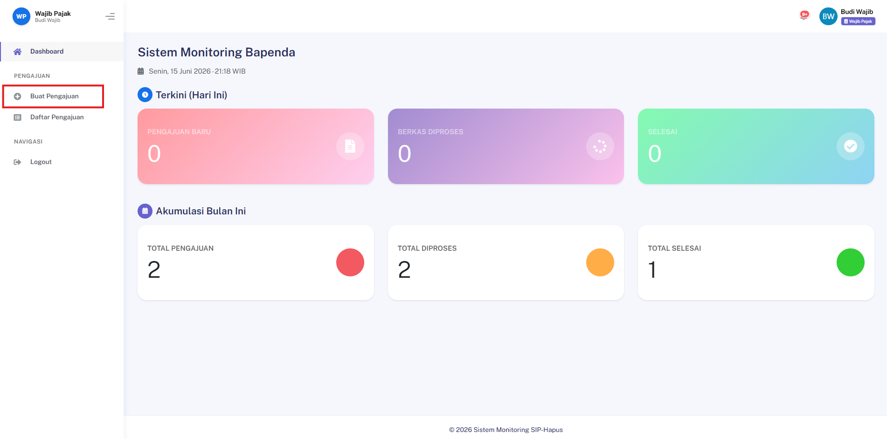

**Langkah 3 — Isi Formulir Data**

Lengkapi formulir data pemilik dan data kendaraan yang tersedia.

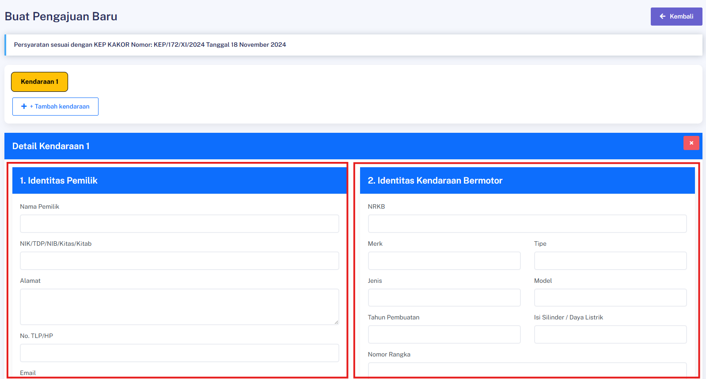

**Langkah 4 — Upload Berkas Persyaratan**

Unggah seluruh berkas yang diperlukan:

| No | Berkas |
|---|---|
| 1 | Surat Permohonan |
| 2 | Surat Pernyataan |
| 3 | KTP |
| 4 | BPKB |
| 5 | TBPKP |
| 6 | Cek Fisik |
| 7 | Foto Ranmor |
| 8 | STNK |

> ⚠️ Pastikan semua berkas terbaca jelas dan dalam format yang didukung sistem.

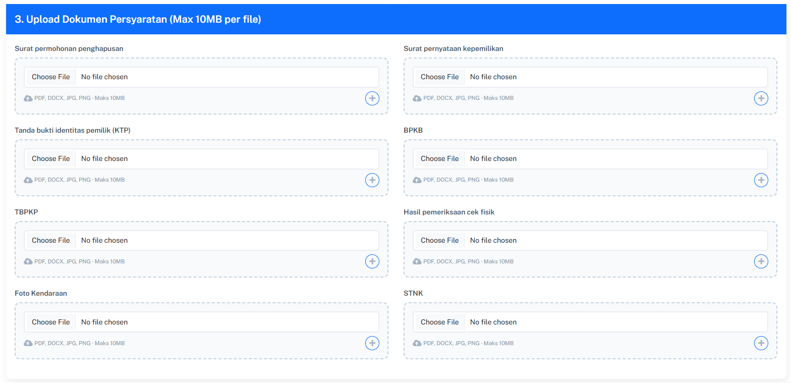

**Langkah 5 — Tambahkan Kendaraan (jika perlu)**)


Klik tombol **Tambah Kendaraan** untuk menambahkan kendaraan lain dan lengkapi seluruh berkas yang diperlukan.


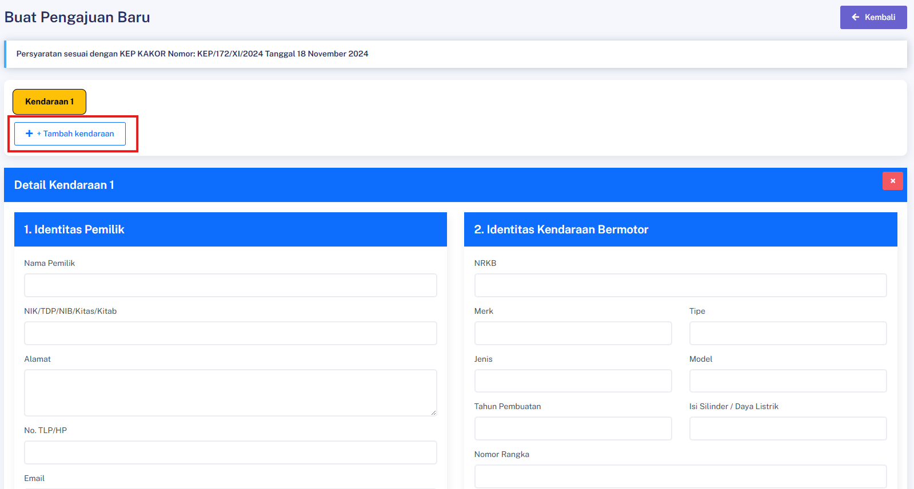

**Langkah 6 — Kirim Pengajuan**

Klik tombol **Simpan & Kirim** untuk mengirimkan pengajuan.

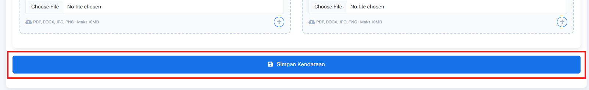

### Hasil yang Diharapkan
- Pengajuan berhasil dikirim dan masuk ke sistem dengan status awal.

---
## Melihat Daftar Pengajuan Saya (WP)

### Deskripsi
Fitur ini memungkinkan Wajib Pajak untuk melihat seluruh pengajuan yang pernah dibuat.

### Prasyarat
- Login sebagai Wajib Pajak dan sudah memiliki minimal 1 pengajuan

### Langkah-Langkah

**Langkah 1 — Login sebagai Wajib Pajak**

Masuk ke sistem menggunakan akun Wajib Pajak.

**Langkah 2 — Buka Menu Daftar Pengajuan**

Navigasi ke:
```
/pengajuan-saya
```

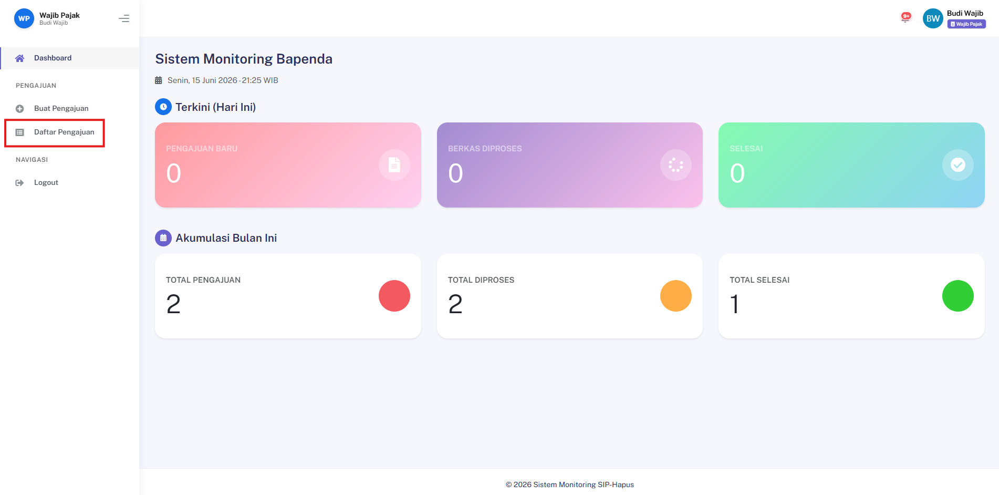

### Hasil yang Diharapkan
- Sistem menampilkan daftar seluruh pengajuan milik Wajib Pajak yang sedang login.

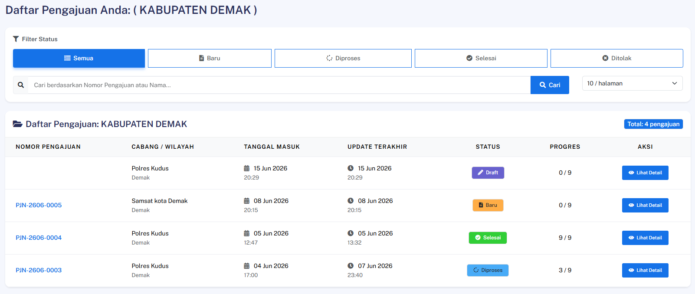

---
## Melihat Daftar Manajemen Pengajuan (Admin/Petugas)

### Deskripsi
Fitur ini memungkinkan petugas (Samsat, Polda, Bapenda, Jasa Raharja) untuk melihat dan mengelola seluruh pengajuan yang masuk.

### Prasyarat
- Login sebagai petugas dengan permission `view_menu_manajemen_pengajuan`

### Langkah-Langkah

**Langkah 1 — Login sebagai Petugas**

Masuk ke sistem menggunakan akun petugas yang berwenang.

**Langkah 2 — Buka Menu Manajemen Pengajuan**

Navigasi ke:
```
/admin/pengajuan
```

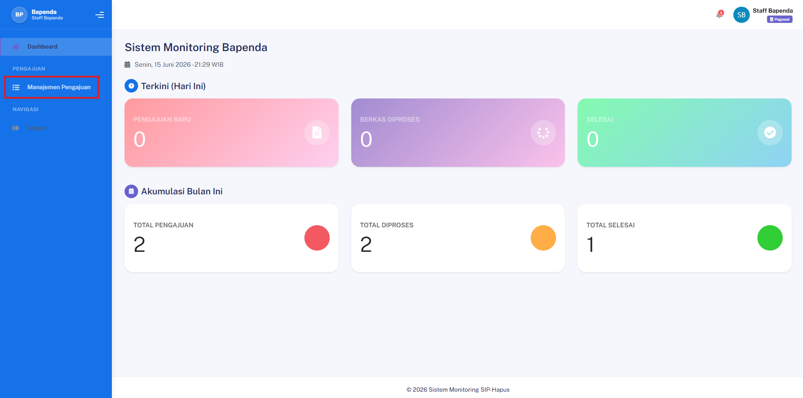

### Hasil yang Diharapkan
- Sistem menampilkan daftar seluruh pengajuan yang dapat dikelola sesuai kewenangan role petugas.

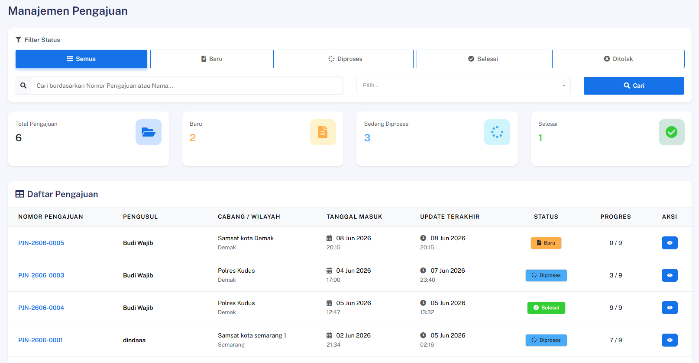

---
## Melihat Detail Pengajuan

### Deskripsi
Fitur ini memungkinkan pengguna untuk melihat informasi lengkap dari sebuah pengajuan.

### Prasyarat
- Login sebagai pengguna yang berwenang, pengajuan tersedia

### Langkah-Langkah

**Langkah 1 — Buka Daftar Pengajuan**

Akses halaman daftar pengajuan sesuai role (WP atau Admin).

**Langkah 2 — Pilih Pengajuan**

Klik salah satu pengajuan dari daftar untuk melihat halaman detailnya.

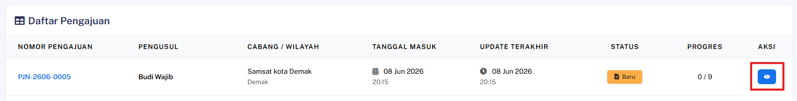

### Hasil yang Diharapkan
- Halaman detail menampilkan seluruh informasi pengajuan, termasuk data kendaraan, berkas, dan status terkini.

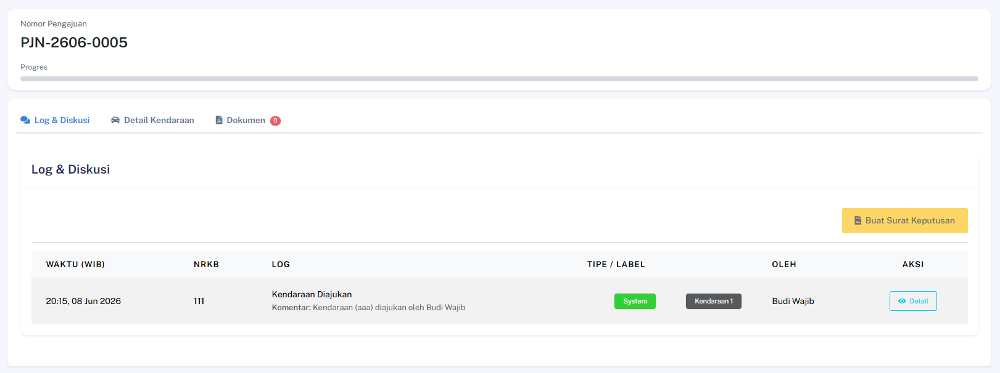

---
## Hapus Pengajuan

### Deskripsi
Fitur ini memungkinkan Admin untuk menghapus pengajuan dari sistem.

### Prasyarat
- Login sebagai Admin

### Langkah-Langkah

**Langkah 1 — Buka Manajemen Pengajuan**

Akses halaman manajemen pengajuan pada sistem.

**Langkah 2 — Klik Hapus Pengajuan**

Klik tombol **Hapus Pengajuan** pada data yang ingin dihapus.

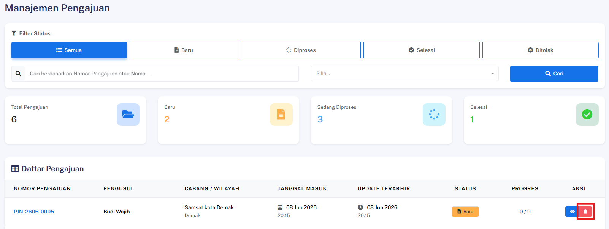

**Langkah 3 — Konfirmasi Penghapusan**

Konfirmasi tindakan penghapusan pada dialog konfirmasi yang muncul.

### Hasil yang Diharapkan
- Pengajuan berhasil dihapus dari database dan muncul pesan sukses.
 
 ---
## Melihat Log Aktivitas per Kendaraan

### Deskripsi
Fitur ini memungkinkan pengguna untuk melihat riwayat aktivitas dan diskusi terkait suatu pengajuan.

### Prasyarat
- Login sebagai pengguna yang berwenang, pengajuan memiliki log aktivitas

### Langkah-Langkah

**Langkah 1 — Buka Detail Pengajuan**

Akses halaman detail pengajuan yang ingin diperiksa log-nya.

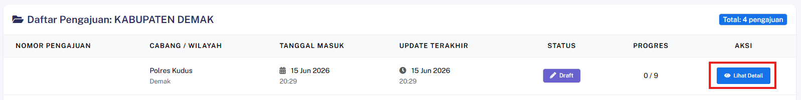

**Langkah 2 — Buka Tab Log & Diskusi**

Klik tab **Log & Diskusi** pada halaman detail pengajuan.

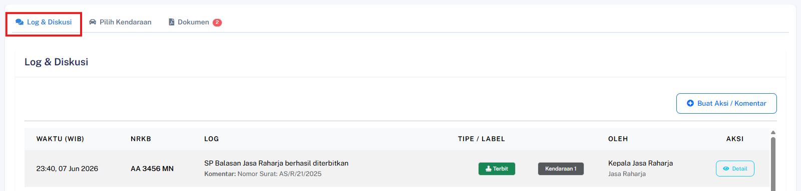

**Langkah 3 — Lihat Detail Log**

Klik salah satu entri log untuk melihat informasi lengkapnya.

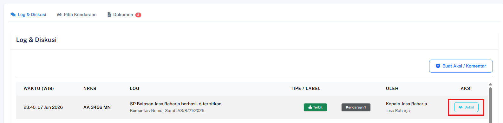

### Hasil yang Diharapkan
- Sistem menampilkan detail aktivitas pada log yang dipilih, termasuk waktu, pelaku, dan keterangan perubahan.

---
## Penerimaan SK Lengkap & Selesai oleh WP

### Deskripsi
Fitur ini memungkinkan Wajib Pajak (WP) untuk melihat, mengunduh seluruh dokumen Surat Keputusan (SK) resmi yang telah diterbitkan oleh masing-masing instansi terkait, serta menandakan bahwa proses pencabutan pajak telah rampung.

### Prasyarat
- Pengguna telah login ke dalam sistem sebagai **Wajib Pajak**
- Seluruh dokumen Surat Keputusan (SK) dari pihak Polda, Bapenda, dan Jasa Raharja telah selesai diterbitkan oleh petugas terkait

### Langkah-Langkah

**Langkah 1 — Akses Halaman Detail Pengajuan**

Buka menu Pengajuan, lalu pilih pengajuan aktif Anda untuk masuk ke halaman detail pengajuan.

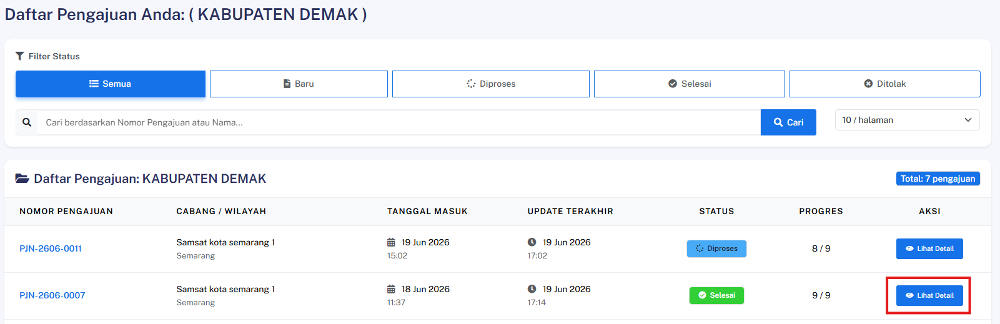

**Langkah 2 — Buka Menu Lampiran Dokumen**

Navigasi ke bagian **Dokumen** pada halaman detail tersebut.

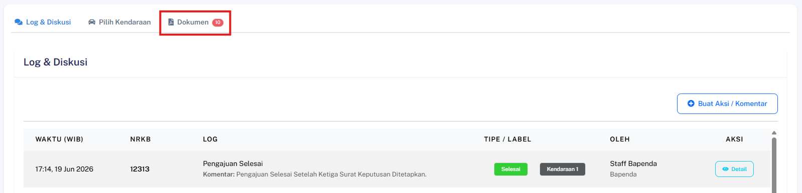

**Langkah 3 — Unduh Berkas Surat Keputusan**

Klik tautan atau tombol unduh yang tersedia pada masing-masing berkas, yaitu **SK Polda**, **SK Bapenda**, dan **SK Jasa Raharja**.

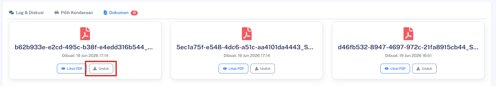

### Hasil yang Diharapkan
- Wajib Pajak berhasil melihat daftar berkas dan mengunduh ketiga dokumen SK tersebut secara lengkap tanpa kendala.
- Status akhir dari proses pengajuan pencabutan pajak secara otomatis diperbarui dan dinyatakan **Selesai** oleh sistem.
