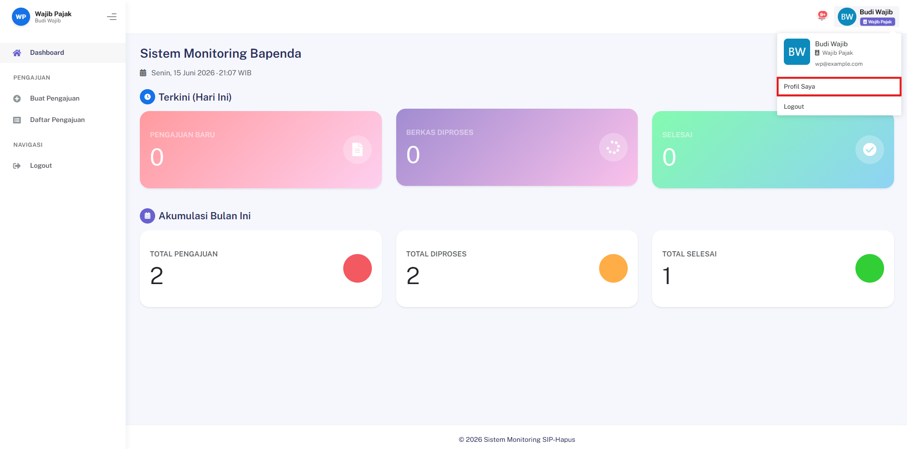
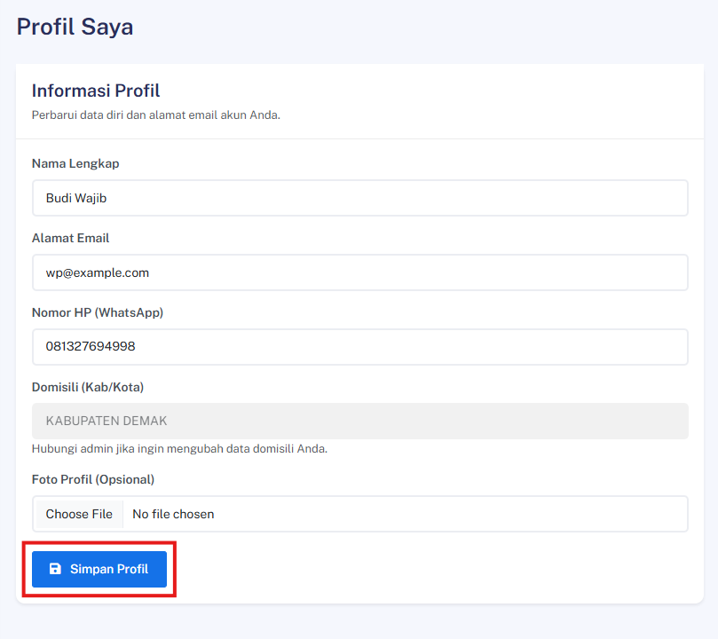
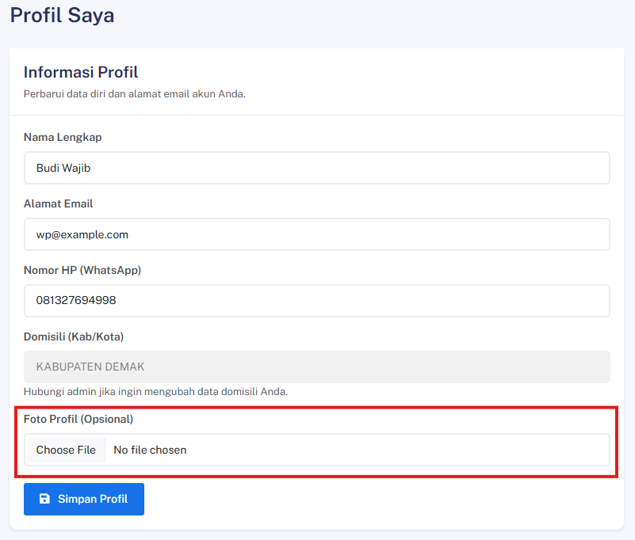
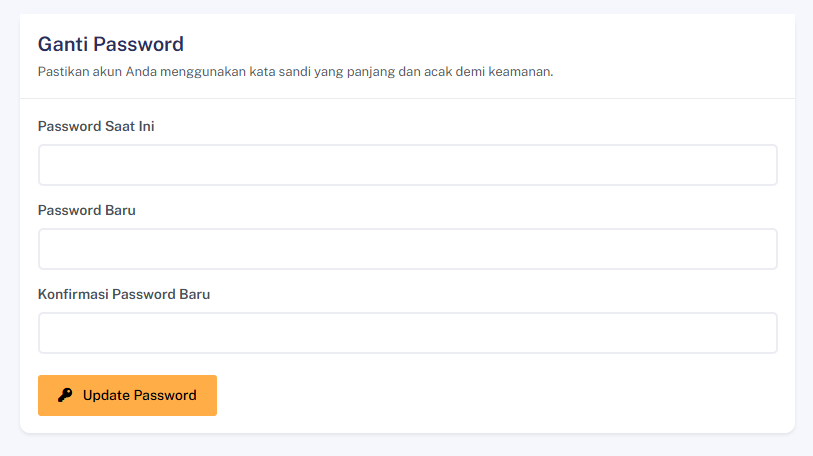

## Edit Informasi Profil (Nama & Email)

### Deskripsi
Fitur ini memungkinkan pengguna untuk memperbarui nama dan alamat email pada akun mereka.

### Prasyarat
- Pengguna sudah login

### Langkah-Langkah

**Langkah 1 — Akses Halaman Profil**

Masuk ke halaman:
```
/profile
```



**Langkah 2 — Ubah Data Profil**

Perbarui kolom **Nama** dan/atau **Email** sesuai kebutuhan.

**Langkah 3 — Simpan Perubahan**

Klik tombol **Simpan** untuk menyimpan pembaruan.



### Hasil yang Diharapkan
- Data profil berhasil diperbarui dan ditampilkan sesuai perubahan yang dilakukan.

---

## Upload Foto Profil

### Deskripsi
Fitur ini memungkinkan pengguna untuk mengunggah atau memperbarui foto profil akun mereka.

### Prasyarat
- Pengguna sudah login

### Langkah-Langkah

**Langkah 1 — Akses Halaman Profil**

Masuk ke halaman Profil Saya (`/profile`).

**Langkah 2 — Pilih File Foto**

Klik area foto profil atau tombol upload, lalu pilih file foto dari perangkat.



> 💡 Gunakan foto dengan format umum (JPG/PNG) dan ukuran yang wajar agar proses upload berjalan lancar.

**Langkah 3 — Simpan Perubahan**

Klik tombol **Simpan** untuk menerapkan foto profil baru.

### Hasil yang Diharapkan
- Foto profil berhasil diperbarui dan tampil pada halaman profil maupun navigasi.

---
## Ganti Password via Halaman Profil

### Deskripsi
Fitur ini memungkinkan pengguna yang sudah login untuk mengganti kata sandi akun secara langsung melalui halaman profil.

### Prasyarat
- Pengguna sudah login

### Langkah-Langkah

**Langkah 1 — Akses Halaman Profil**

Masuk ke halaman Profil Saya (`/profile`).

**Langkah 2 — Isi Formulir Ganti Password**

Pada bagian **Ganti Password**, lengkapi kolom berikut:

| Kolom | Keterangan |
|---|---|
| **Password Lama** | Kata sandi yang saat ini digunakan |
| **Password Baru** | Kata sandi baru yang diinginkan |
| **Konfirmasi Password Baru** | Ulangi kata sandi baru |



**Langkah 3 — Simpan Password Baru**

Klik tombol **Update Password** untuk menyimpan perubahan.

### Hasil yang Diharapkan
- Password berhasil diperbarui. Gunakan password baru pada login berikutnya.
