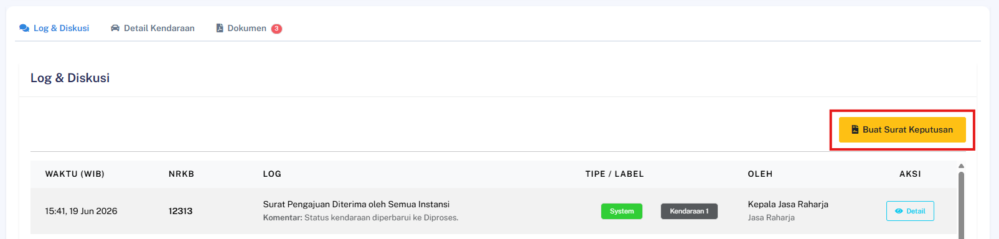
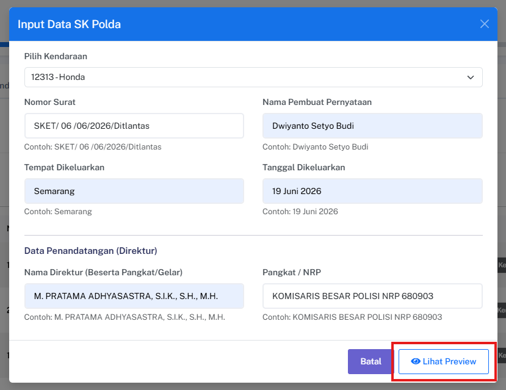
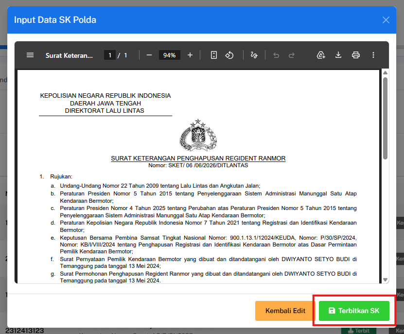
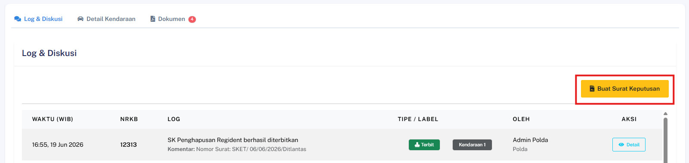
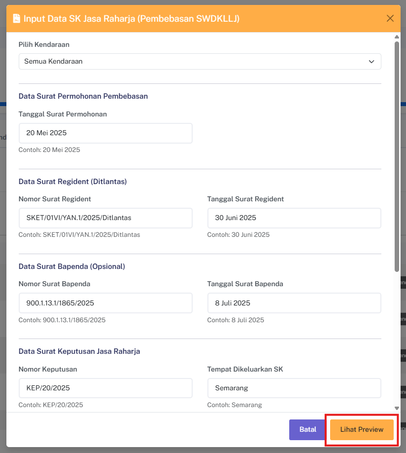
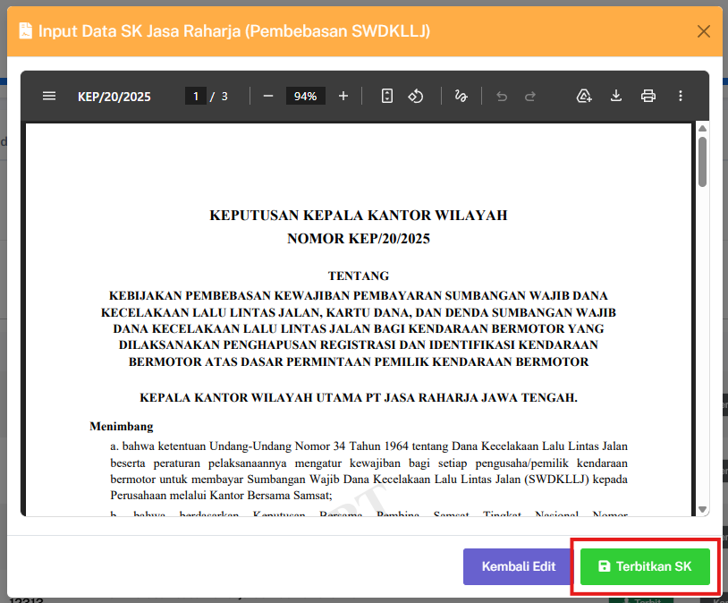
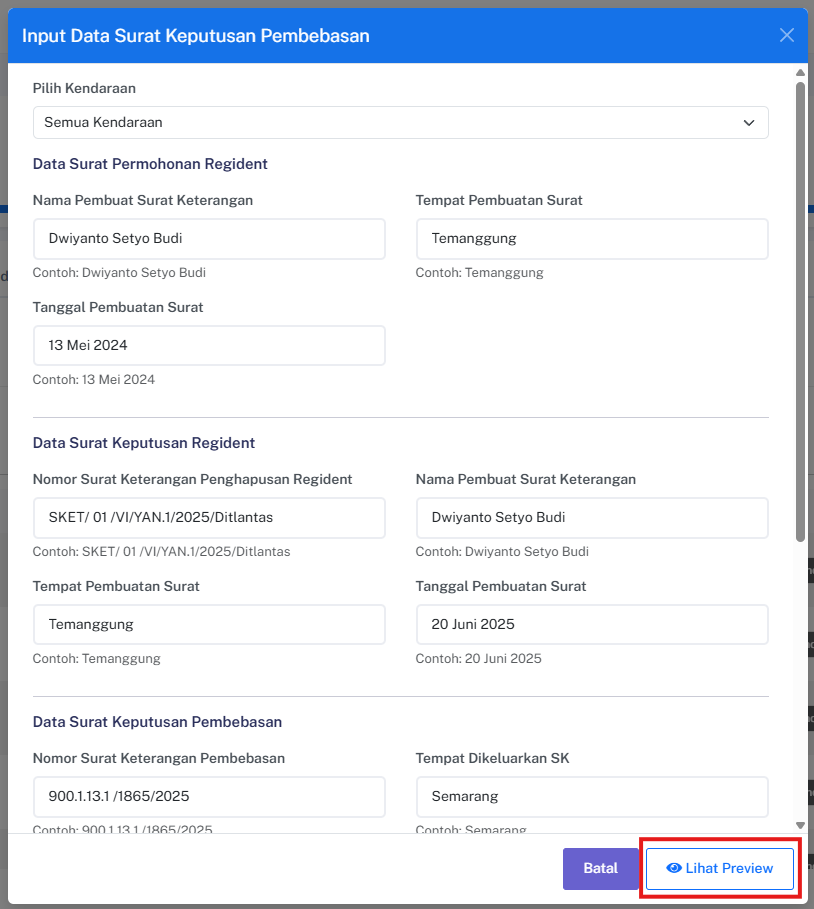
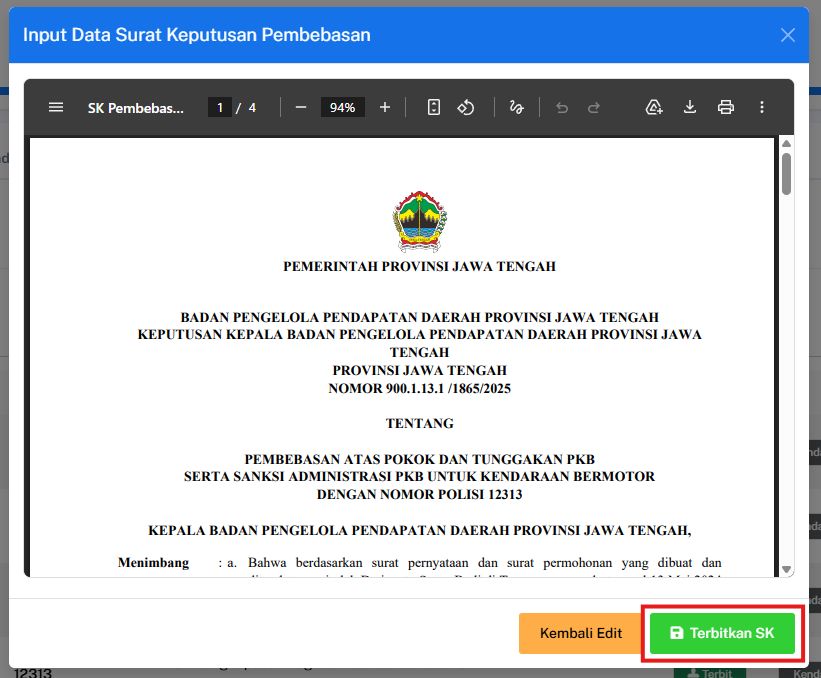

## Preview SK sebelum Submit

### Deskripsi
Fitur ini memungkinkan pengguna dari instansi Polda atau Bapenda untuk melihat pratinjau (preview) dokumen PDF Surat Keputusan (SK) terlebih dahulu sebelum data tersebut disimpan atau dikirim secara resmi oleh sistem.

### Prasyarat
- Pengguna telah login ke dalam sistem sebagai **Polda**
- Status Surat Pengajuan (SP) terkait sudah berada dalam tahap **Fully Approved**

### Langkah-Langkah

**Langkah 1 — Inisiasi Pembuatan Surat Keputusan**

Cari pengajuan yang telah disetujui penuh, klik tombol **Buat Surat Keputusan**, lalu pilih jenis SK yang sesuai pada menu yang tersedia.

**Langkah 2 — Isi Formulir Surat Keputusan**

Lengkapi seluruh data penulisan dokumen yang diminta pada jendela tampilan (modal form) SK yang muncul.

**Langkah 3 — Tampilkan Pratinjau Dokumen**

Cari dan klik tombol **Lihat Preview** untuk memproses tampilan sementara dokumen.

> ⚠️ **Mode Pratinjau:** Langkah ini berjalan dalam mode preview murni. Sistem tidak akan membuat berkas penyimpanan log baru, tidak menyimpan media ke server, dan tidak memicu pengiriman notifikasi WhatsApp.

**Langkah 4 — Terbitkan SK**

Pastikan isi pratinjau surat keputusan sudah tepat dan klik tombol **Terbitkan SK**.

### Hasil yang Diharapkan
- File PDF Surat Keputusan (SK) berhasil di-render oleh sistem secara real-time berdasarkan data formulir modal.
- Dokumen pratinjau berhasil ditampilkan dengan aman di dalam komponen *iframe preview* tanpa memicu fungsi penyimpanan data atau pengiriman eksternal.

---
## Penerbitan SK Pembebasan SWDKLLJ (Jasa Raharja)

### Deskripsi
Fitur ini memungkinkan petugas yang berwenang untuk menerbitkan dokumen Surat Keputusan (SK) Pembebasan SWDKLLJ secara resmi, menyimpan data ke dalam sistem, serta memicu pengiriman notifikasi otomatis kepada Wajib Pajak.

### Prasyarat
- Pengguna telah login sebagai **Jasa Raharja**
- Status Surat Pengajuan (SP) terkait sudah berada dalam tahap **Fully Approved**

### Langkah-Langkah

**Langkah 1 — Inisiasi Pembuatan SK Pembebasan**

Cari pengajuan yang telah disetujui penuh, klik tombol **Buat Surat Keputusan**, lalu pilih opsi **SK Jasa Raharja**.

**Langkah 2 — Isi Formulir SK Pembebasan**

Lengkapi seluruh kolom data yang diperlukan pada jendela tampilan (*modal form*) yang muncul di layar. Jika sudah sesuai, klik **Lihat Preview**.

**Langkah 3 — Terbitkan Dokumen**

Klik tombol **Terbitkan SK** untuk menyelesaikan proses penerbitan Surat Keputusan.

### Hasil yang Diharapkan
- Sistem otomatis membuka *tab* baru di *browser* yang menampilkan file PDF dari SK Pembebasan SWDKLLJ yang telah diterbitkan.
- Tampilan pada *tab* utama otomatis dialihkan (*redirect*) menuju halaman **Log & Diskusi**.
- Aktivitas penerbitan dokumen berhasil tercatat secara permanen di dalam log riwayat sistem.
- Sistem berhasil mengirimkan pesan notifikasi otomatis via WhatsApp kepada Wajib Pajak terkait.

---
## Penerbitan SK Pembebasan PKB (Bapenda)

### Deskripsi
Fitur ini memungkinkan instansi Bapenda untuk menerbitkan dokumen Surat Keputusan (SK) Pembebasan PKB secara resmi, mengamankan catatan log sistem, serta memicu pengiriman pesan pemberitahuan otomatis kepada Wajib Pajak.

### Prasyarat
- Pengguna telah login ke dalam sistem sebagai **Bapenda**
- Status Surat Pengajuan (SP) terkait sudah berada dalam tahap **Fully Approved**

### Langkah-Langkah

**Langkah 1 — Inisiasi Pembuatan SK Pembebasan**

Cari pengajuan yang telah disetujui penuh, klik tombol **Buat Surat Keputusan**, lalu pilih opsi **SK Kepala Bapenda (Pembebasan)**.

**Langkah 2 — Isi Formulir SK Pembebasan**

Lengkapi seluruh kolom data dokumen yang diminta pada jendela tampilan (*modal form*) SK Pembebasan PKB yang muncul. Jika sudah sesuai, klik **Lihat Preview**.

**Langkah 3 — Terbitkan Dokumen**

Klik tombol **Terbitkan SK** untuk menyelesaikan proses penerbitan Surat Keputusan.

### Hasil yang Diharapkan
- Sistem otomatis membuka *tab* baru di *browser* yang menampilkan berkas PDF dari SK Pembebasan PKB yang telah diterbitkan.
- Tampilan layar pada *tab* utama otomatis dialihkan (*redirect*) menuju halaman **Log & Diskusi**.
- Aktivitas penerbitan dokumen berhasil tercatat secara permanen di dalam riwayat log sistem.
- Sistem berhasil mengirimkan pesan notifikasi resmi via WhatsApp kepada pihak Wajib Pajak.
