## Cek Kesesuaian Data & Ajukan ke Polda (Samsat)

### Deskripsi
Fitur ini memungkinkan petugas Samsat untuk memverifikasi kesesuaian data pengajuan dan meneruskannya ke Polda.

### Prasyarat
- Login sebagai Samsat, terdapat pengajuan baru yang masuk

### Langkah-Langkah

**Langkah 1 — Login sebagai Samsat**

Masuk ke sistem menggunakan akun Samsat.

**Langkah 2 — Buka Detail Pengajuan**

Akses halaman manajemen pengajuan, lalu detail pengajuan yang baru masuk.

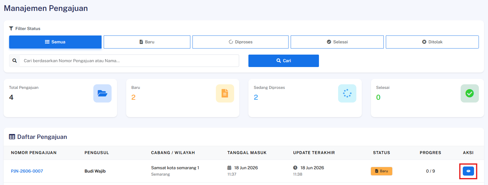

**Langkah 3 — Periksa Kesesuaian Data**

Tinjau seluruh data dan berkas yang dilampirkan oleh Wajib Pajak untuk memastikan kesesuaiannya.

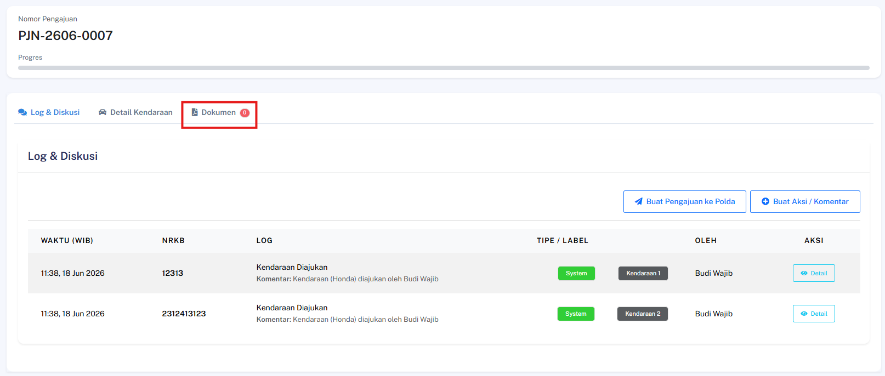

**Langkah 4 — Ajukan ke Polda**

Klik tombol **Ajukan ke Polda** untuk meneruskan pengajuan.

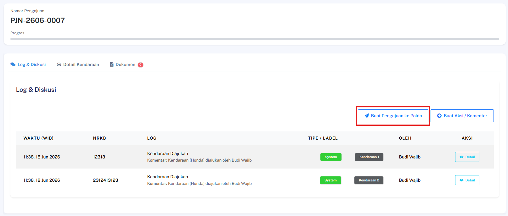

### Hasil yang Diharapkan
- Pengajuan berhasil diteruskan ke Polda dan status pengajuan diperbarui sesuai.

---
## Verifikasi & Setujui SP oleh Polda

### Deskripsi
Fitur ini memungkinkan petugas Polda untuk mereview dan menyetujui Surat Pengajuan (SP) yang diteruskan dari Samsat.

### Prasyarat
- Login sebagai Polda, SP ke Polda sudah masuk dengan status **pending**

### Langkah-Langkah

**Langkah 1 — Login sebagai Polda**

Masuk ke sistem menggunakan akun Polda.

**Langkah 2 — Buka Detail Pengajuan**

Akses halaman detail pengajuan yang terkait dengan SP yang akan diverifikasi.

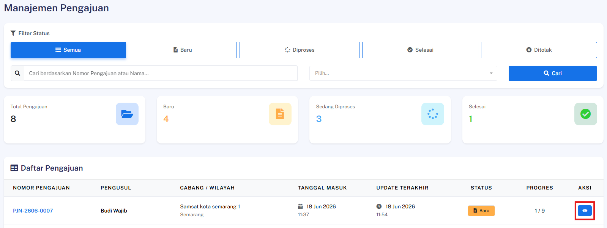

**Langkah 3 — Review Dokumen SP**

Tinjau seluruh dokumen Surat Pengajuan yang tersedia.

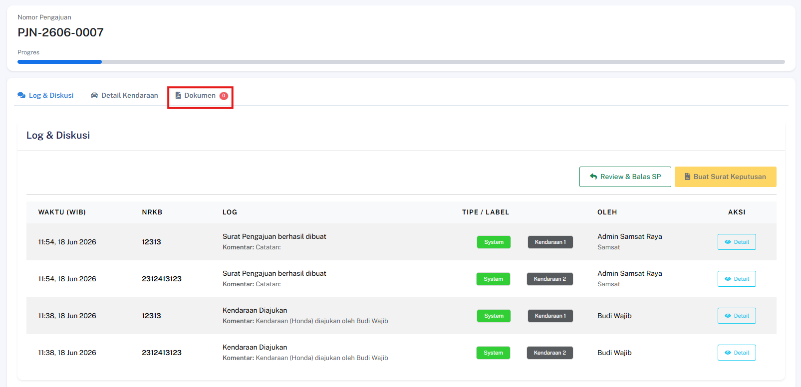

**Langkah 4 — Setujui atau Tolak Dokumen**

Klik tombol **Review & Balas SP** untuk memberikan persetujuan ataupun penolakan.

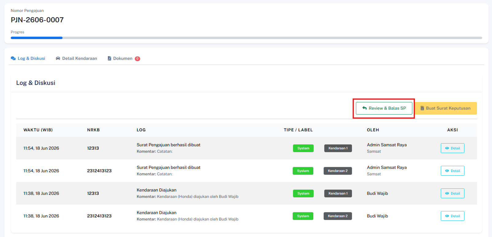

### Hasil yang Diharapkan
- Surat Pengajuan berhasil disetujui dan status pengajuan diperbarui ke tahap berikutnya.

---
## Polda Ajukan SP ke Bapenda & Jasa Raharja

### Deskripsi
Fitur ini memungkinkan instansi Polda untuk mengajukan Surat Pengajuan (SP) yang telah disetujui kepada pihak Bapenda dan Jasa Raharja.

### Prasyarat
- Pengguna telah login ke dalam sistem sebagai **Polda**
- Surat Pengajuan (SP) Polda sudah dalam status **Approved**

### Langkah-Langkah

**Langkah 1 — Akses Pengajuan Terkait**

Pilih pengajuan yang telah disetujui (*Approved*) dan buka halaman detail.

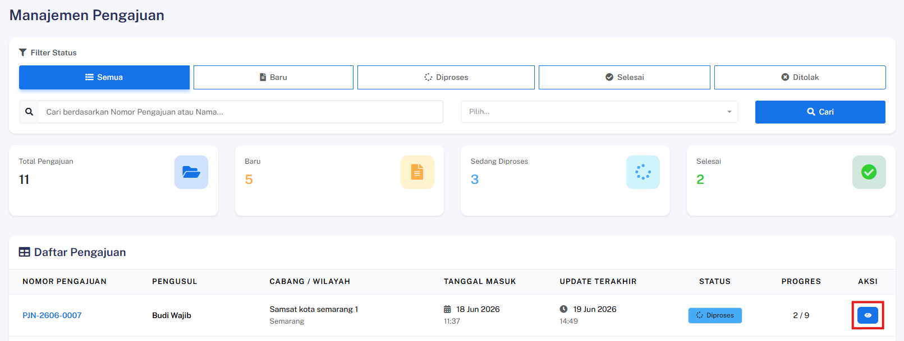

**Langkah 2 — Inisiasi Pengajuan ke Bapenda & Jasa Raharja**

Cari dan klik tombol **Buat Pengajuan ke Bapenda/Jasa Raharja**.

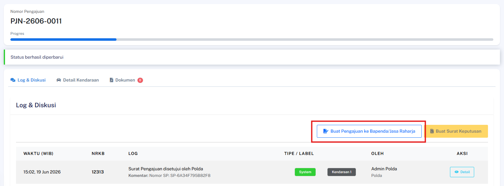

**Langkah 3 — Isi Formulir Pengajuan**

Lengkapi kolom dokumen yang diperlukan pada formulir:

| Kolom | Keterangan |
|---|---|
| **Nomor Surat** | Nomor surat resmi yang valid |
| **Tempat** | Lokasi Polda |
| **Nama Direktur** | Nama lengkap direktur dengan gelar dalam huruf kapital |
| **Nama Pembuat Pernyataan** | Nama petugas penerbit SP |
| **Tanggal Dikeluarkan SP** | Tanggal SP dibuat |
| **Pangkat Direktur** | Pangkat direktur dalam huruf kapital |

> ⚠️ **Pastikan** nomor surat yang dimasukkan sudah benar dan sesuai dengan dokumen fisik, karena nomor ini akan tercatat dalam log sistem secara permanen.

Setelah semua terisi, klik **Lihat Preview**.

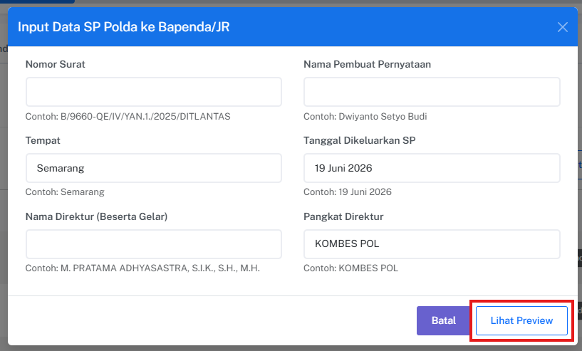

**Langkah 4 — Simpan Draft**

Cek preview surat dan jika sudah benar, klik **Simpan sebagai Draft**.

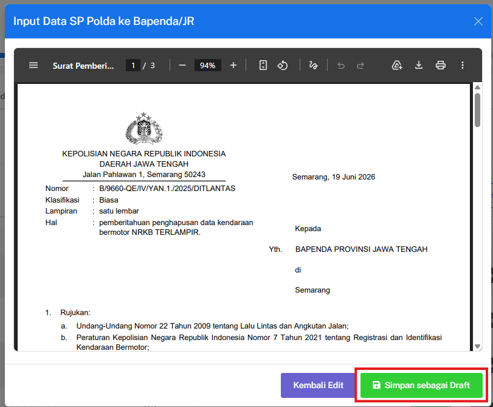

**Langkah 5 — Terbitkan SP**

Klik tombol **Terbitkan SP** untuk menerbitkan surat pengajuan.

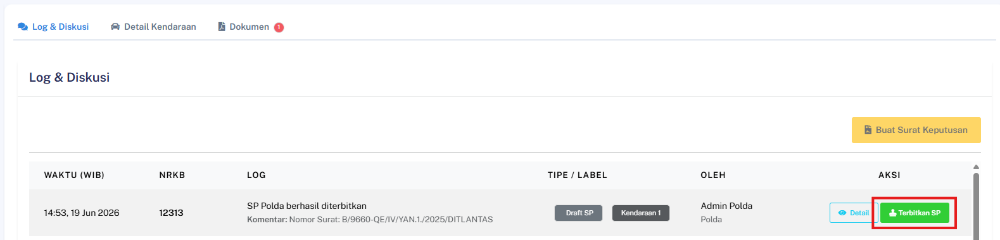

### Hasil yang Diharapkan
- Surat Pengajuan (SP) ke Bapenda & Jasa Raharja berhasil dibuat oleh sistem.
- Log aktivitas pengiriman surat berhasil tercatat dalam riwayat sistem.
- Status progres pengajuan otomatis ter-update ke tahap berikutnya.

---

## Persetujuan SP oleh Bapenda

### Deskripsi
Fitur ini memungkinkan instansi Bapenda untuk meninjau dan menyetujui Surat Pengajuan (SP) yang dikirimkan oleh pihak Polda.

### Prasyarat
- Pengguna telah login ke dalam sistem sebagai **Bapenda**
- Surat Pengajuan (SP) dari Polda sudah masuk ke dalam daftar verifikasi Bapenda

### Langkah-Langkah

**Langkah 1 — Akses Detail Pengajuan**

Buka menu Surat Pengajuan, cari dokumen yang masuk dari Polda, lalu klik untuk membuka halaman detail pengajuan.

**Langkah 2 — Setujui Dokumen**

Tinjau seluruh informasi dokumen, kemudian cari dan klik tombol **Review & Balas SP**.

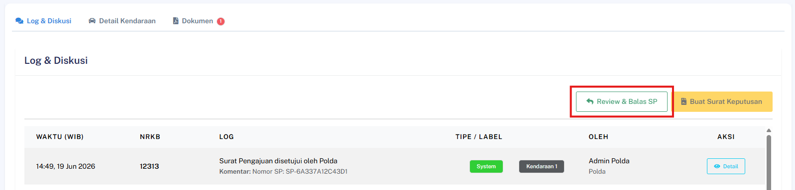

**Langkah 3 — Isi Formulir Balasan SP**

Lengkapi kolom dokumen yang diperlukan pada formulir:

| Kolom | Keterangan |
|---|---|
| **Nomor Surat** | Nomor surat resmi yang valid |
| **Lampiran** | Jumlah dan satuan lampiran yang disertakan |
| **Sifat** | Sifat surat balasan |
| **Hal** | Perihal kepentingan surat |
| **Provinsi** | Provinsi lokasi Bapenda |
| **Jabatan** | Jabatan pembuat surat balasan |
| **Nama Penandatangan** | Nama dan gelar pembuat surat dalam huruf kapital |
| **NIP** | Nomor Induk Pegawai pembuat surat |

> ⚠️ **Pastikan** nomor surat yang dimasukkan sudah benar dan sesuai dengan dokumen fisik, karena nomor ini akan tercatat dalam log sistem secara permanen.

Setelah semua terisi, klik **Lihat Preview**. Atau klik "Tolak" untuk menolak pengajuan.

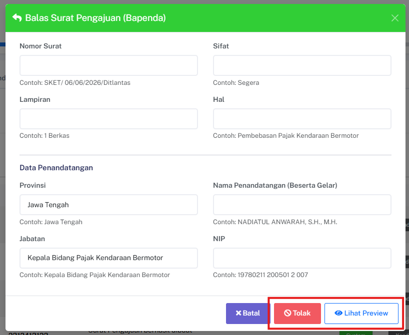

**Langkah 4 — Simpan Draft**

Cek preview surat dan jika sudah benar, klik **Simpan sebagai Draft**.

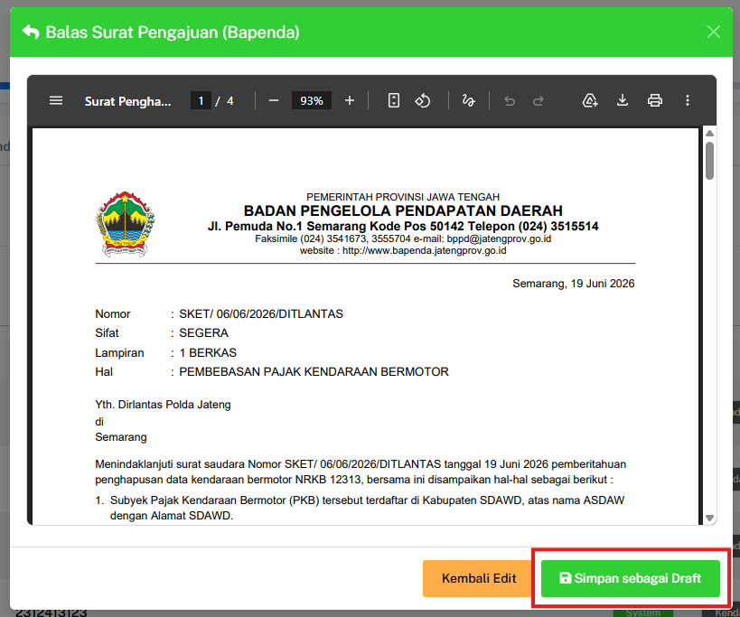

**Langkah 5 — Terbitkan SP**

Klik tombol **Terbitkan SP** untuk menerbitkan surat balasan pengajuan.

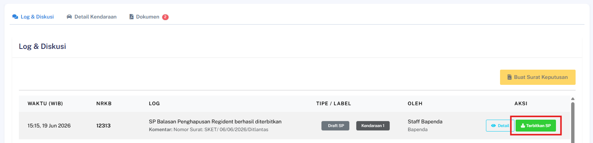

### Hasil yang Diharapkan
- Status persetujuan dari pihak Bapenda berhasil berubah menjadi **Approved**.
- Riwayat persetujuan tercatat pada sistem dan progres dokumen diperbarui.

---

## Persetujuan SP oleh Jasa Raharja

### Deskripsi
Fitur ini memungkinkan pihak Jasa Raharja untuk meninjau dan menyetujui Surat Pengajuan (SP) yang dikirimkan oleh pihak Polda.

### Prasyarat
- Pengguna telah login ke dalam sistem sebagai **Jasa Raharja**
- Surat Pengajuan (SP) dari Polda sudah masuk ke dalam daftar verifikasi Jasa Raharja

### Langkah-Langkah

**Langkah 1 — Akses Detail Pengajuan**

Buka menu Surat Pengajuan, cari dokumen yang masuk dari Polda, lalu klik untuk membuka halaman detail pengajuan.

**Langkah 2 — Setujui Dokumen**

Tinjau seluruh informasi dokumen, kemudian cari dan klik tombol **Review & Balas SP**.

**Langkah 3 — Isi Formulir Balasan SP**

Lengkapi kolom dokumen yang diperlukan pada formulir:

| Kolom | Keterangan |
|---|---|
| **Nomor Surat** | Nomor surat resmi yang valid |
| **Nomor Surat Bapenda** | Nomor surat resmi yang valid dari Bapenda |
| **Nomor Surat Regident** | Nomor surat resmi yang valid dari Polda |
| **Tempat Surat** | Lokasi Jasa Raharja |
| **Nama Penandatangan** | Nama pembuat surat |
| **Tanggal Surat** | Tanggal pembuatan surat |
| **Jabatan Penandatangan** | Jabatan pembuat surat |

> ⚠️ **Pastikan** nomor surat yang dimasukkan sudah benar dan sesuai dengan dokumen fisik, karena nomor ini akan tercatat dalam log sistem secara permanen.

Setelah semua terisi, klik **Lihat Preview**. Atau klik "Tolak" untuk menolak pengajuan.

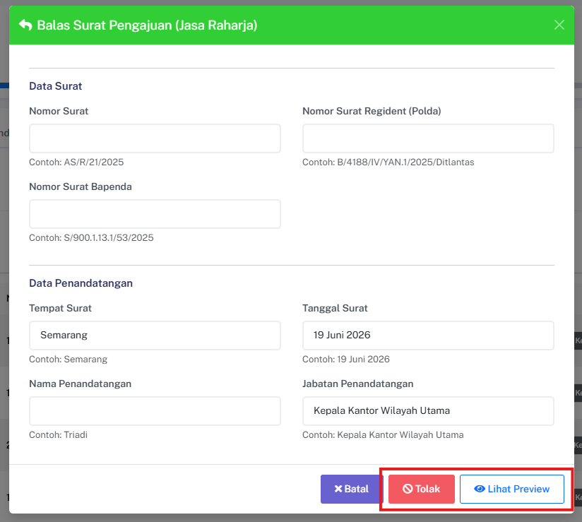

**Langkah 4 — Simpan Draft**

Cek preview surat dan jika sudah benar, klik **Simpan sebagai Draft**.

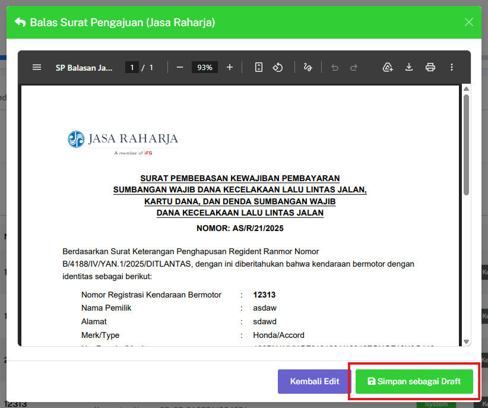

**Langkah 5 — Terbitkan SP**

Klik tombol **Terbitkan SP** untuk menerbitkan surat balasan pengajuan.

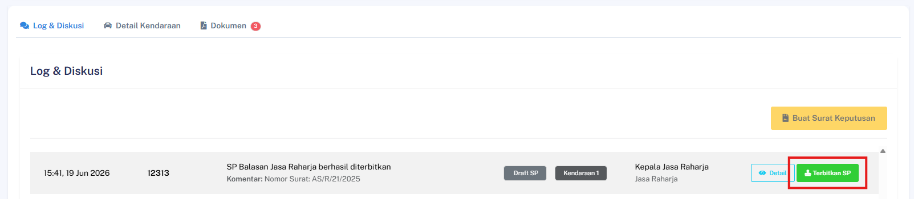

> ⚠️ **Catatan Sistem:** Jika instansi Bapenda juga telah menyetujui dokumen ini sebelumnya, sistem akan otomatis mengubah status global pengajuan menjadi Fully Approved dan memperbarui status kendaraan.

### Hasil yang Diharapkan
- Status persetujuan dari pihak Jasa Raharja berhasil berubah menjadi **Approved**.
- Jika kedua instansi (Bapenda & Jasa Raharja) sudah memberikan persetujuan, status pengajuan otomatis berubah menjadi **Fully Approved**.
- Status kendaraan otomatis naik dan diperbarui menjadi **'Diproses'**.

---

## Preview PDF Surat Pengajuan

### Deskripsi
Fitur ini memungkinkan pengguna untuk melihat pratinjau (preview) dokumen PDF dari Surat Pengajuan langsung di dalam aplikasi sebelum mengunduhnya.

### Prasyarat
- Pengguna telah login ke dalam sistem
- Dokumen Surat Pengajuan (SP) sudah tersedia atau sudah dibuat pada sistem

### Langkah-Langkah

**Langkah 1 — Akses Detail Pengajuan**

Buka menu Surat Pengajuan dan pilih salah satu dokumen yang tersedia untuk masuk ke halaman detail pengajuan.

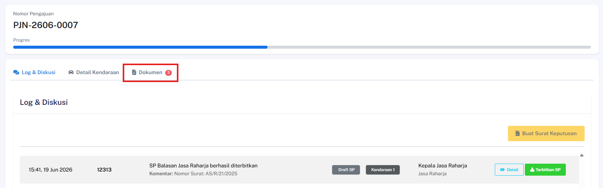

**Langkah 2 — Buka Pratinjau PDF**

Cari dan klik ikon atau tautan **Preview PDF SP** yang terletak pada halaman detail dokumen.

### Hasil yang Diharapkan
- File PDF Surat Pengajuan berhasil di-render dengan benar tanpa merusak tata letak.
- Dokumen PDF berhasil ditampilkan secara langsung di dalam *browser* atau komponen *iframe* aplikasi.
