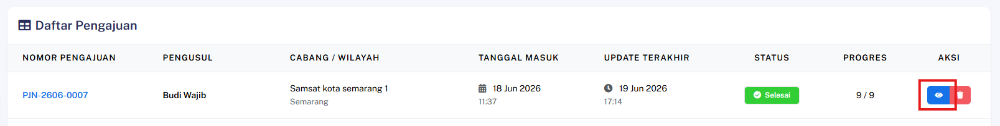
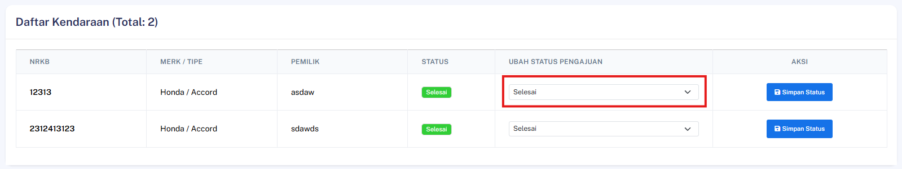
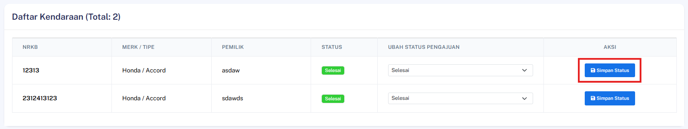

## Admin Update Status Kendaraan

### Deskripsi
Fitur ini memungkinkan Admin atau petugas yang berwenang untuk memperbarui status kendaraan.

### Prasyarat
- Pengguna telah login ke dalam sistem sebagai **Admin** atau petugas yang memiliki hak akses (*permission*) `approve_status_pengajuan`
- Halaman detail pengajuan yang memuat daftar kendaraan sudah terbuka

### Langkah-Langkah

**Langkah 1 — Akses Detail Pengajuan**

Buka detail pengajuan yang memuat daftar kendaraan yang ingin diperbarui.

**Langkah 2 — Pilih Status Baru**

Pilih status kendaraan yang diinginkan melalui menu pilihan (*dropdown*) status yang tersedia.

**Langkah 3 — Eksekusi Pembaruan Status**

Klik tombol **Simpan Status** untuk memproses pembaruan data.

### Hasil yang Diharapkan
- Status dari seluruh kendaraan yang diubah berhasil diperbarui sesuai dengan status baru yang dipilih.
- Sistem berhasil mencatat log aktivitas pembaruan data secara terpisah untuk setiap kendaraan yang mengalami perubahan status (*log tercatat per kendaraan*).
